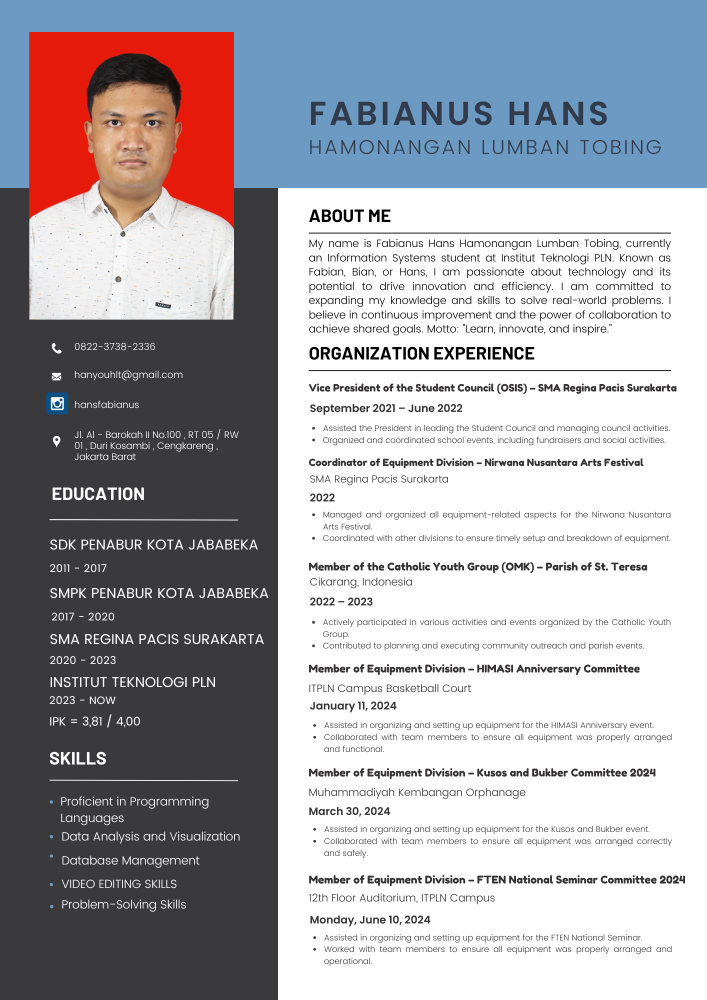

# fabianushansh.l.t.github.io-
Personal Profile and CV Website 
<!DOCTYPE html>
<html lang="id">
<head>
    <meta charset="UTF-8">
    <meta name="viewport" content="width=device-width, initial-scale=1.0">
    <title>Fabianus Hans Hamonangan Lumban Tobing</title>
    <link rel="stylesheet" href="styles.css">
    
</head>
<body onload="showPage('profile')">
    <header>
        <h1>Fabianus Hans Hamonangan Lumban Tobing</h1>
        <nav>
            <button onclick="showPage('profile')">Profil</button>
            <button onclick="showPage('cv')">CV</button>
            <button onclick="showPage('contact')">Kontak</button>
        </nav>
    </header>
    
    <section id="profile" class="content">
        <h2>Profil Pribadi</h2>
        
        
Mahasiswa semester 4 di Institut Teknologi PLN, Jurusan Sistem Informasi.

        <h3>Keterampilan</h3>
        <ul>
            <li>Pengembangan Web</li>
            <li>Desain Grafis</li>
            <li>Analisis Data</li>
            <li>Database Management</li>
        </ul>
        <h3>Minat</h3>
        <ul>
            <li>Teknologi Informasi</li>
            <li>Inovasi Digital</li>
            <li>Olahraga</li>
            <li>Musik</li>
        </ul>
    </section>
    
    <section id="cv" class="content">
        <h2>Curriculum Vitae</h2>
        <h3>Pendidikan</h3>
        
S1 Sistem Informasi, Institut Teknologi PLN, Semester 4

        <h3>Pengalaman Kerja</h3>
        
Belum ada pengalaman kerja karena masih kuliah.

        <h3>Proyek</h3>
        
PKM: Pengembangan Formulasi Sampo Anti Jamur Berbasis Alami dari Keratin Bulu Ayam dan Minyak Kelapa sebagai Inovasi Ramah Lingkungan.

        <h3>Informasi Kontak</h3>
        
Telepon: 082237382336

        
Email: <a href="mailto:hanyouhlt@gmail.com">hanyouhlt@gmail.com</a>

        <h3>Gambar CV</h3>
        
    </section>
    
    <section id="contact" class="content">
        <h2>Kontak Saya</h2>
        <form action="submit_form.php" method="post">
            <label for="name">Nama:</label>
            <input type="text" id="name" name="name" required>
            
            <label for="email">Email:</label>
            <input type="email" id="email" name="email" required>
            
            <label for="phone">Nomor Telepon:</label>
            <input type="tel" id="phone" name="phone" required>
            
            <label for="message">Pesan:</label>
            <textarea id="message" name="message" rows="4" required></textarea>
            
            <button type="submit">Kirim</button>
        </form>
    </section>
</body>
</html>
